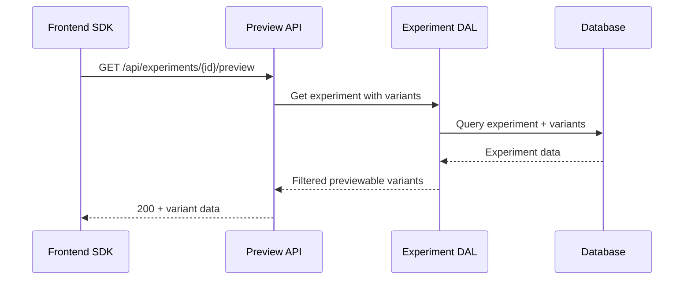

# Design Document

## Overview

The experiment preview API provides a single read-only endpoint to fetch previewable variants for experiments. This enables frontend SDKs to render preview overlays during the pre-launch phase without affecting live traffic allocation.

## Architecture

### Core Flow



## Components and Interfaces

### 1. HTTP Route Handler

**Location**: `src/interfaces/http/experiments/preview.ts`

```typescript
interface PreviewResponse {
  experimentId: string;
  variants: PreviewVariant[];
}

interface PreviewVariant {
  variantId: string;
  selector: string | null;
  html: string;
  css: string | null;
  position: InjectPosition;
}
```

**Route**: `GET /api/experiments/:experimentId/preview`

### 2. Extended Experiment DAL

**Location**: `src/infra/dal/experiment.ts` (extend existing)

```typescript
class ExperimentDAL {
  /**
   * Get previewable variants for an experiment
   * Only returns variants for experiments in DRAFT or COMPLETED status
   * Excludes experiments that are RUNNING (live)
   */
  static async getPreviewableVariants(
    experimentId: string,
    projectId: string
  ): Promise<PreviewVariant[] | null>
}
```

## Data Models

### Database Schema Changes

**No new tables required**. Uses existing schema:

- `experiments` table: Use `status` field to determine previewability
- `experiment_variants` table: Contains all variant data needed for preview

### Preview Lifecycle Logic

```typescript
// Only DRAFT and COMPLETED experiments are previewable
// RUNNING experiments are live and not previewable
const PREVIEWABLE_STATUSES = ['DRAFT', 'COMPLETED'] as const;

function isPreviewable(status: JobStatus): boolean {
  return PREVIEWABLE_STATUSES.includes(status);
}
```

## Error Handling

### HTTP Status Codes

- **200**: Success with variant data
- **404**: Experiment not found or not previewable
- **500**: Internal server error

### Error Response Format

```typescript
interface ErrorResponse {
  error: string;
  message: string;
}
```